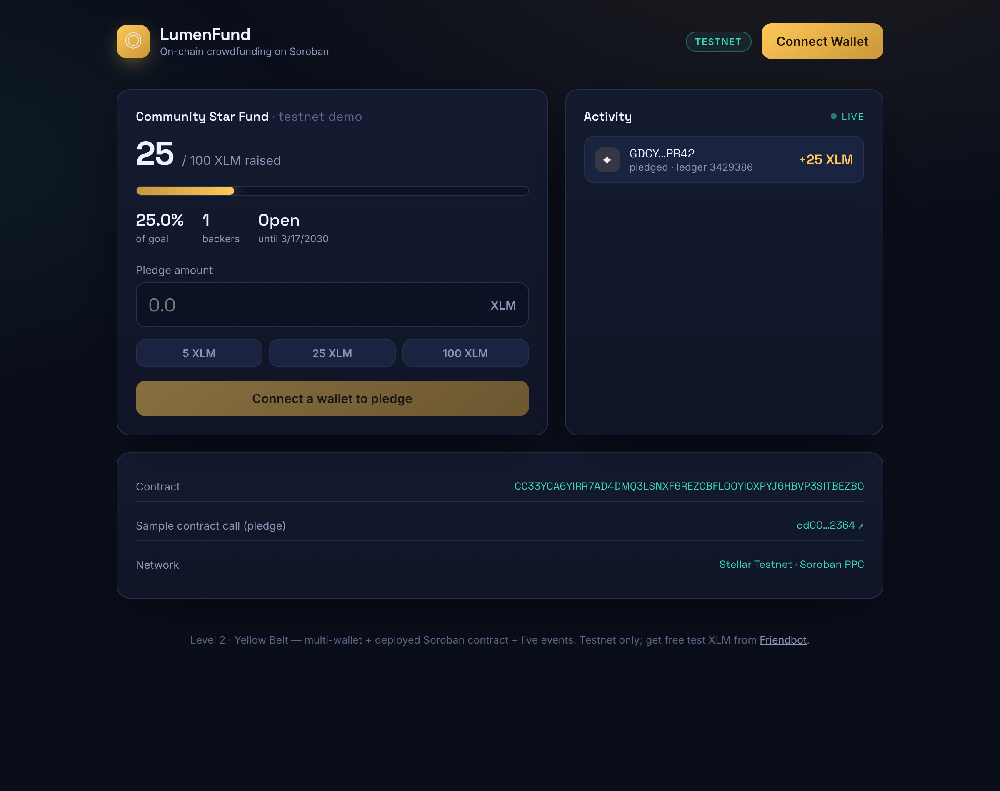
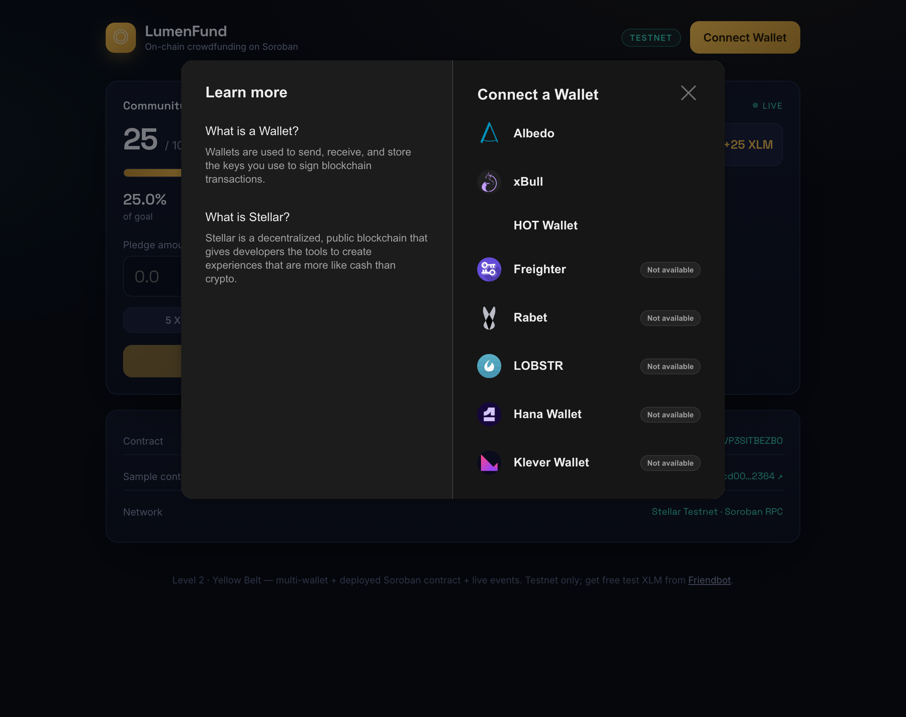

# 🟡 LumenFund — Level 2 Yellow Belt

An on-chain **crowdfunding dApp** on Stellar. Backers connect any Stellar wallet,
pledge testnet XLM to a deployed **Soroban** contract, and watch the funding
progress and activity feed update **live from chain events**.

Built with a Rust/Soroban smart contract + React + Vite + Stellar Wallets Kit.



---

## ✅ What this demonstrates (Level 2 requirements)

| Requirement | How it's met |
|---|---|
| **Multi-wallet integration** | Stellar Wallets Kit — Freighter, xBull, Albedo, LOBSTR, Rabet, Hana, HOT, Klever |
| **Deploy a contract to testnet** | `crowdfund` contract deployed and verified (address below) |
| **Call contract from the frontend** | `pledge()` invoked from the browser; `get_state()` / `pledged_by()` read live |
| **Read + write contract data** | Reads campaign state; writes pledges that move real XLM into the contract |
| **Event listening & state sync** | Polls Soroban RPC `getEvents` for `pledge`/`withdraw` events → live feed + progress bar |
| **Transaction status tracking** | Building → signing → submitting → success/fail, with an explorer link |
| **3+ error types handled** | Wallet not found · request rejected · insufficient balance · campaign ended · invalid amount |

---

## 🔗 On-chain artifacts (verifiable on Stellar Explorer)

| Item | Value |
|---|---|
| **Deployed contract address** | [`CC33YCA6YIRR7AD4DMQ3LSNXF6REZCBFLOOYIOXPYJ6HBVP3SITBEZBO`](https://stellar.expert/explorer/testnet/contract/CC33YCA6YIRR7AD4DMQ3LSNXF6REZCBFLOOYIOXPYJ6HBVP3SITBEZBO) |
| **Transaction hash of a contract call** (a `pledge`) | [`cd00f271fc7b5c7d9e88dd9c4df5ffa59526fbe33b614dd42c0ead8428b72364`](https://stellar.expert/explorer/testnet/tx/cd00f271fc7b5c7d9e88dd9c4df5ffa59526fbe33b614dd42c0ead8428b72364) |
| **Deployment transaction** | [`47ec3d5e003d2f00658077a1ab4aee41b402ee4ba566ffebc8a83aba756e8673`](https://stellar.expert/explorer/testnet/tx/47ec3d5e003d2f00658077a1ab4aee41b402ee4ba566ffebc8a83aba756e8673) |
| **Network** | Stellar Testnet · Soroban RPC (`https://soroban-testnet.stellar.org`) |
| **Pledge token** | Native XLM SAC `CDLZFC3SYJYDZT7K67VZ75HPJVIEUVNIXF47ZG2FB2RMQQVU2HHGCYSC` |
| **Beneficiary** | `GDCYUH2BCISLDVE3Z2QMTMVF3EUXTXCDGZEWI3THT4QJJCDFB4ZJPR42` |

> **Live demo:** deploy the `level-2/` folder to Vercel/Netlify (see below). GitHub
> Pages for this repo is already used by Level 1, so the demo isn't hosted here.

---

## 📸 Wallet options available

Clicking **Connect Wallet** opens the Stellar Wallets Kit picker with every
supported wallet (installed ones are selectable; others show *Not available*):



---

## 🧠 How it works

```
 Browser (React)                  Soroban (testnet)
 ────────────────                 ──────────────────
 Stellar Wallets Kit  ──sign──▶   crowdfund contract
        │                          ├─ pledge(backer, amount)  ── moves XLM via native SAC
        │  build + simulate        ├─ withdraw()              ── beneficiary payout after goal
        ▼  (Soroban RPC)           ├─ get_state() / pledged_by()
 submit + poll status              └─ emits `pledge` / `withdraw` events
        ▲                                   │
        └──────── getEvents() poll ◀────────┘   (live feed + progress bar)
```

### The contract (`contract/src/lib.rs`)
- `__constructor(beneficiary, token, goal, deadline)` — atomic deploy-time setup
- `pledge(backer, amount)` — `require_auth`, pulls XLM via the SAC token client, records the
  pledge, bumps the backer count, **emits a `pledge` event**, returns the running total
- `withdraw()` — beneficiary-only payout once the deadline passes **and** the goal is met
- `get_state()` / `pledged_by(addr)` — read-only views for the frontend
- Typed `Error` enum (codes 1–8), checked arithmetic, TTL bumping

11 unit tests cover pledging, event emission, deadline/goal enforcement, withdrawal
rules, and re-pledge accounting. Run them with `cargo test`.

### Error handling (frontend)
Wallet errors are normalised in [`src/wallet.js`](src/wallet.js) and contract error
codes are mapped to friendly messages in [`src/crowdfund.js`](src/crowdfund.js):

| Trigger | Message shown |
|---|---|
| No wallet extension installed | *Wallet not found. Install a Stellar wallet…* |
| User rejects the signature | *Request rejected in the wallet.* |
| Not enough XLM for the pledge | *Insufficient balance to cover that pledge plus fees.* |
| Pledging after the deadline (`Error #2`) | *This campaign has ended — pledging is closed.* |
| Amount ≤ 0 (`Error #1`) | *Enter an amount greater than zero.* |

---

## 🚀 Run it locally

**Prerequisites:** Node.js 20+, and (for the contract) Rust + the
[`stellar` CLI](https://developers.stellar.org/docs/tools/cli/install-cli).

### Frontend
```bash
cd level-2
npm install
npm run dev          # http://localhost:5173
```
Get free testnet XLM for your wallet from [Friendbot](https://friendbot.stellar.org),
make sure the wallet is set to **Testnet**, then connect and pledge.

The contract address is baked into [`src/config.js`](src/config.js); override it with a
`VITE_CONTRACT_ID` env var to point at your own deployment.

### Contract (build / test / deploy your own)
```bash
cd level-2/contract
cargo test                         # 11 passing unit tests
stellar contract build             # -> target/wasm32v1-none/release/crowdfund.wasm

# fund a deployer key, then deploy with constructor args
stellar keys generate deployer --network testnet --fund
stellar contract deploy \
  --wasm target/wasm32v1-none/release/crowdfund.wasm \
  --source deployer --network testnet -- \
  --beneficiary "$(stellar keys address deployer)" \
  --token CDLZFC3SYJYDZT7K67VZ75HPJVIEUVNIXF47ZG2FB2RMQQVU2HHGCYSC \
  --goal 1000000000 \
  --deadline 1900000000
```

### Deploy the frontend (optional live demo)
```bash
cd level-2
npm run build        # outputs dist/
# then drag dist/ to Netlify, or `vercel`, or `netlify deploy --prod`
```

---

## 🗂️ Structure
```
level-2/
├── contract/               # Soroban crowdfunding contract (Rust)
│   ├── src/lib.rs          # contract logic + events + errors
│   └── src/test.rs         # 11 unit tests
├── src/
│   ├── config.js           # network + contract config, unit helpers
│   ├── wallet.js           # Stellar Wallets Kit + wallet-error mapping
│   ├── crowdfund.js        # build/sim/submit, state reads, event polling
│   └── App.jsx             # UI: campaign, pledge form, live feed, status
├── screenshots/
└── README.md
```

> ⚠️ Testnet only. Do not point this at mainnet without an audit. Testnet resets
> periodically — the contract may need redeploying after a reset.
